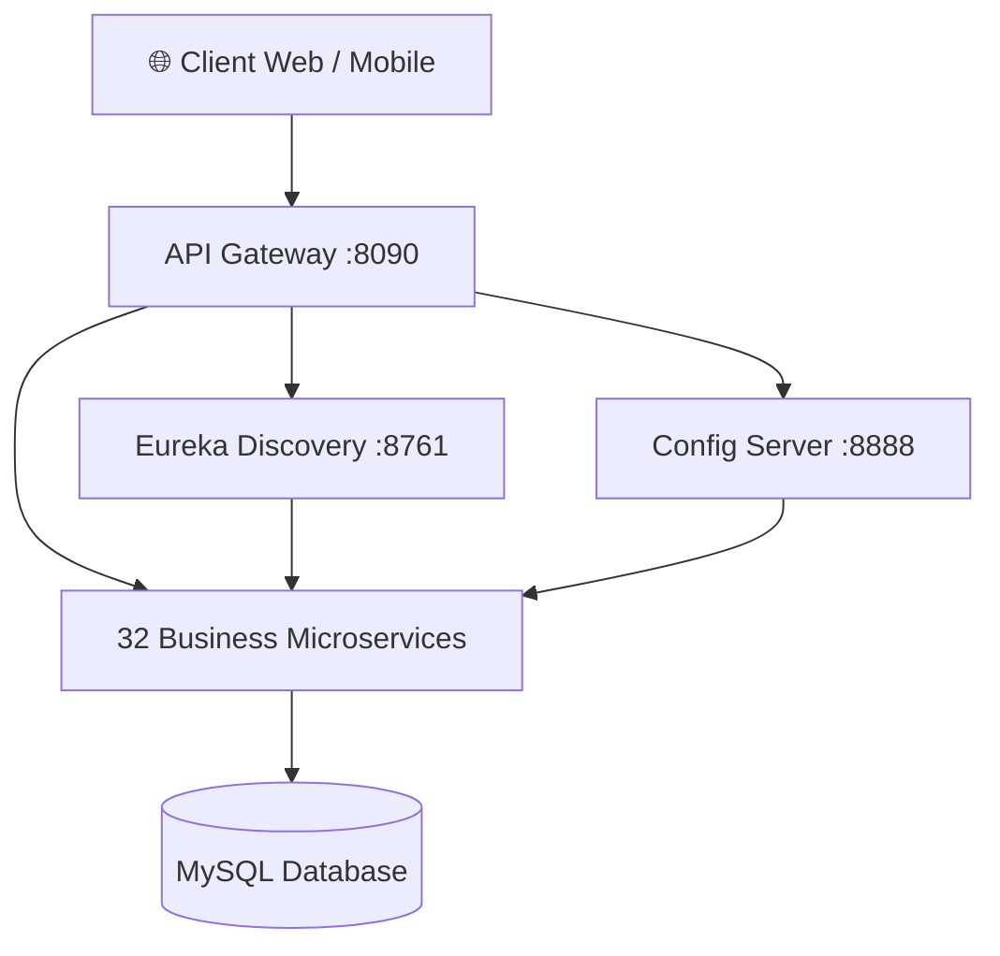

# 🏗️ ETEC University — Backend

**Architecture microservices** de la plateforme universitaire ETEC. Backend distribué basé sur Spring Boot 3.5 avec Spring Cloud, orchestré via API Gateway, Discovery Service et Config Server.

---

## 🏛️ Architecture



**Flux :** Client → API Gateway → Eureka Discovery → Microservice → MySQL

---

## 🛠️ Stack Technique

| Technologie | Version |
|-------------|---------|
| Java | 21 |
| Spring Boot | 3.5.14 |
| Spring Cloud | 2025.0.0 |
| Spring Cloud Gateway | ✓ |
| Eureka Discovery | ✓ |
| Spring Cloud Config | ✓ |
| JPA / Hibernate | ✓ |
| MySQL | 8.x |
| Maven | ≥ 3.9 |
| Lombok | ✓ |

---

## 🚀 Démarrage

### Prérequis

```bash
# Vérifier les versions installées
java --version            # Java 21+
mvn --version             # Maven 3.9+
mysql --version           # MySQL 8.x
```

- **Java 21** (JDK)
- **Maven** ≥ 3.9
- **MySQL** 8.x avec base `siteetec` créée
- **Node.js** (optionnel, pour le frontend)

### Infrastructure (ordre obligatoire)

Lancer dans cet ordre depuis la racine (`/backend/`) :

```bash
# 1. Config Server (port 8888)
mvn spring-boot:run -pl config_server -DskipTests -q

# 2. Discovery Service / Eureka (port 8761)
mvn spring-boot:run -pl discovery_service -DskipTests -q

# 3. API Gateway (port 8090)
mvn spring-boot:run -pl api_gateway -DskipTests -q
```

### Microservices Métier

Après l'infrastructure, lancer les services souhaités (chaque service = un processus indépendant) :

```bash
# Services principaux
mvn spring-boot:run -pl actualite -DskipTests    # Actualités
mvn spring-boot:run -pl admin -DskipTests        # Administration
mvn spring-boot:run -pl utilisateur -DskipTests  # Utilisateurs / Auth
mvn spring-boot:run -pl coursenligne -DskipTests  # Cours en ligne
mvn spring-boot:run -pl note -DskipTests          # Notes
mvn spring-boot:run -pl presence -DskipTests      # Présences
mvn spring-boot:run -pl empoiDuTemps -DskipTests  # Emploi du temps

# Services supports
mvn spring-boot:run -pl notification -DskipTests # Notifications
mvn spring-boot:run -pl email -DskipTests         # Emails
mvn spring-boot:run -pl messagerie -DskipTests    # Messagerie
mvn spring-boot:run -pl visio -DskipTests         # Visioconférence
mvn spring-boot:run -pl quiz -DskipTests          # Quiz
mvn spring-boot:run -pl progression -DskipTests   # Progression
mvn spring-boot:run -pl common -DskipTests        # Bibliothèque commune
```

### Build complet

```bash
# Builder tous les modules (sans tests)
mvn clean install -DskipTests

# Avec logs réduits (mode silencieux)
mvn clean install -DskipTests -q
```

---

## 📋 Microservices

### Infrastructure

| Module | Port | Rôle |
|--------|------|------|
| `config_server` | 8888 | Configuration centralisée |
| `discovery_service` | 8761 | Registre Eureka (Service Discovery) |
| `api_gateway` | 8090 | Point d'entrée unique, routage, auth |

### Gestion des Utilisateurs

| Module | Spring App | Rôle |
|--------|-----------|------|
| `utilisateur` | `UTILISATEUR` | Auth, users, JWT |
| `admin` | `ADMIN` | Gestion des administrateurs |
| `Etudiant/etudiant` | `ETUDIANT` | Profils étudiants |
| `Enseignant/enseignant` | `ENSEIGNANT` | Profils enseignants |
| `profile` | `PROFILE` | Profils utilisateurs |
| `Encadreur/encadreur` | `ENCADREUR` | Encadreurs pédagogiques |

### Pédagogie

| Module | Spring App | Rôle |
|--------|-----------|------|
| `coursenligne` | `COURSENLIGNE` | Cours, chapitres, leçons, ressources, vidéos |
| `note` | `NOTE` | Notes des étudiants |
| `moyenne` | `MOYENNE` | Calcul des moyennes |
| `matiere` | `MATIERE` | Matières enseignées |
| `filiere` | `FILIERE` | Filières / parcours |
| `niveau` | `NIVEAU` | Niveaux (L1, L2, L3, M1, M2) |
| `semestre` | `SEMESTRE` | Semestres académiques |
| `univesitaire` | `UNIVESITAIRE` | Années universitaires |
| `domaine` | `DOMAINE` | Domaines de formation |
| `memoire` | `MEMOIRE` | Mémoires de fin d'études |
| `devoir` | `DEVOIR` | Devoirs et exercices |
| `quiz` | `QUIZ` | Quiz et évaluations |
| `progression` | `PROGRESSION` | Suivi de progression |
| `enligne` | `ENLIGNE` | Formations en ligne |
| `emploiDuTemps` | `EMPLOIDUTEMPS` | Emplois du temps |

### Communication & Contenu

| Module | Spring App | Rôle |
|--------|-----------|------|
| `actualite` | `ACTUALITE` | Actualités et annonces |
| `notification` | `NOTIFICATION` | Notifications push |
| `email` | `EMAIL` | Envoi d'emails |
| `messagerie` | `MESSAGERIE` | Messagerie interne |
| `visio` | `VISIO` | Visioconférence |
| `president` | `PRESIDENT` | Messages du président |
| `slides` | `SLIDES` | Slides / carousel |
| `organigramme` | `ORGANIGRAMME` | Organigramme de l'école |
| `historique` | `HISTORIQUE` | Historique de l'école |
| `presence` | `PRESENCE` | Gestion des présences |

---

## ⚙️ Configuration

### Base de données

```properties
# Chaque microservice se connecte à la même base MySQL
spring.datasource.url=jdbc:mysql://localhost:3306/siteetec?useSSL=false&serverTimezone=UTC
spring.datasource.username=root
spring.datasource.password=<votre-mot-de-passe>
spring.jpa.hibernate.ddl-auto=update
```

### Config Server (optionnel)

Les microservices peuvent lire leur config depuis le Config Server (`:8888`) ou utiliser leurs `application.properties` locaux via :

```properties
spring.config.import=optional:configserver:http://localhost:8888
```

### Ports dynamiques (Eureka)

Les microservices utilisent `server.port=0` pour un port aléatoire. Eureka les découvre automatiquement.

---

## 🔌 API Gateway

Point d'entrée unique : `http://localhost:8090`

La Gateway :
- Route les requêtes vers les microservices via Eureka (`lb://SERVICE_NAME`)
- Filtre l'authentification JWT
- Centralise CORS, rate limiting

### Routes principales

```yaml
/auth/**         → lb://UTILISATEUR
/api/admins/**   → lb://ADMIN
/api/etudiants/** → lb://ETUDIANT
/api/enseignants/** → lb://ENSEIGNANT
/api/cours/**    → lb://COURSENLIGNE
/api/actualites/** → lb://ACTUALITE
/api/notes/**    → lb://NOTE
... 20+ autres routes
```

---

## 🧪 Développement

### Commandes utiles

```bash
# Lancer un service spécifique avec profil dev
mvn spring-boot:run -pl <module> -Dspring-boot.run.profiles=dev

# Build sans tests
mvn clean install -DskipTests

# Voir les logs d'un service
tail -f logs/<module>.log
```

### Bonnes pratiques

- **Nommage** : `spring.application.name` en MAJUSCULES pour Eureka
- **Entités** : Annotation `@Table(name = "prefixe_nom")` pour éviter les conflits
- **Ports** : Utiliser `server.port=0` pour les services Eureka
- **Exceptions** : `GlobalExceptionHandler` dans le module `common/`

---

## 🔗 Frontend

L'interface utilisateur React se trouve dans le dossier [`../frontend/`](../frontend/).

```env
VITE_API_GATEWAY_URL=http://localhost:8090
```

---

## 📄 Licence

Projet privé — ETEC University
